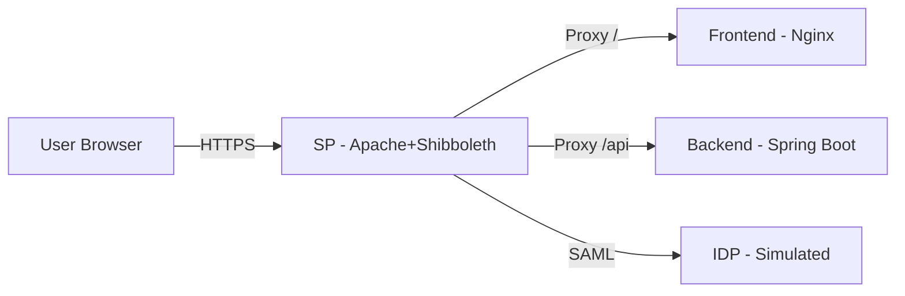

# Shibboleth Demo Application on OpenShift/Kubernetes

This project demonstrates a containerized application with Shibboleth authentication, consisting of:
1.  **SP (Service Provider)**: Apache HTTPD + Shibboleth (Reverse Proxy).
2.  **Frontend**: Nginx Microservice (Static Content).
3.  **Backend**: Spring Boot Microservice (API).
4.  **IDP (Identity Provider)**: A simulated SAML IDP (`kristophjunge/test-saml-idp`).

## Prerequisites

-   Docker / Podman
-   Kubernetes Cluster (Minikube, Kind, or OpenShift)
-   `kubectl` or `oc` CLI
-   Maven (optional, Dockerfile handles build)

## Structure

-   `backend/`: Spring Boot application source and Dockerfile.
-   `frontend/`: Nginx application source and Dockerfile.
-   `sp/`: Apache/Shibboleth configuration and Dockerfile.
-   `k8s/`: Kubernetes deployment manifests.

## Build Instructions

### 1. Build Backend Image

```bash
cd backend
docker build -t demo-backend:latest .
```

### 2. Build Frontend Image

```bash
cd frontend
docker build -t demo-frontend:latest .
```

### 3. Build SP Image

```bash
cd sp
docker build -t demo-sp:latest .
```

> **Note:** If using Minikube/Kind, make sure to point your docker-env to the cluster's docker daemon or load the images into the cluster.
> For Minikube: `eval $(minikube docker-env)`

## Deployment

### 1. Apply Kubernetes Manifests

```bash
kubectl apply -f k8s/
```

### 2. Configure Local Networking

Add the following to your `/etc/hosts` file to map the domains to your local machine:

```
127.0.0.1 sp.example.com idp.example.com
```

### 3. Port Forwarding

Open two terminal windows to forward ports to the services:

**Terminal 1 (SP):**
```bash
kubectl port-forward svc/sp-service 8080:8080
```

**Terminal 2 (IDP):**
```bash
kubectl port-forward svc/idp-service 8081:8080
```

## Testing

1.  Open your browser and navigate to [http://sp.example.com:8080/](http://sp.example.com:8080/).
2.  You should be redirected to the IDP login page (`idp.example.com:8081`).
3.  Login with default credentials:
    -   Username: `user1`
    -   Password: `user1pass`
4.  Upon successful login, you will be redirected back to the SP, which proxies to the **Frontend**.
5.  The page should display "Shibboleth Demo Frontend" and the JSON response from the **Backend API** (via SP proxy) containing your user attributes.

## Architecture


